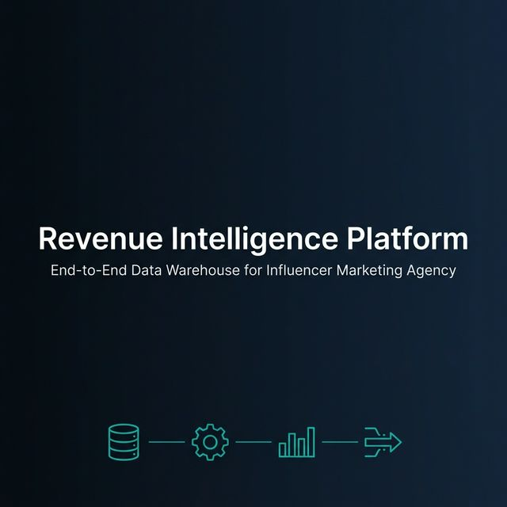
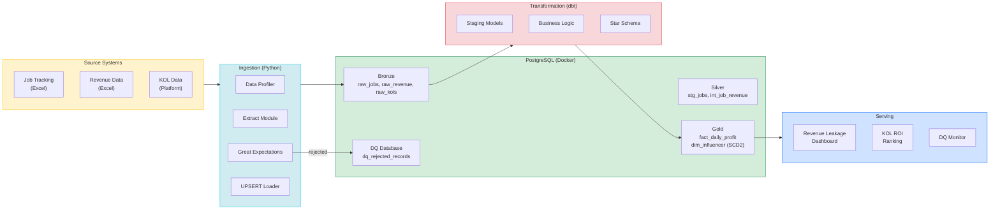
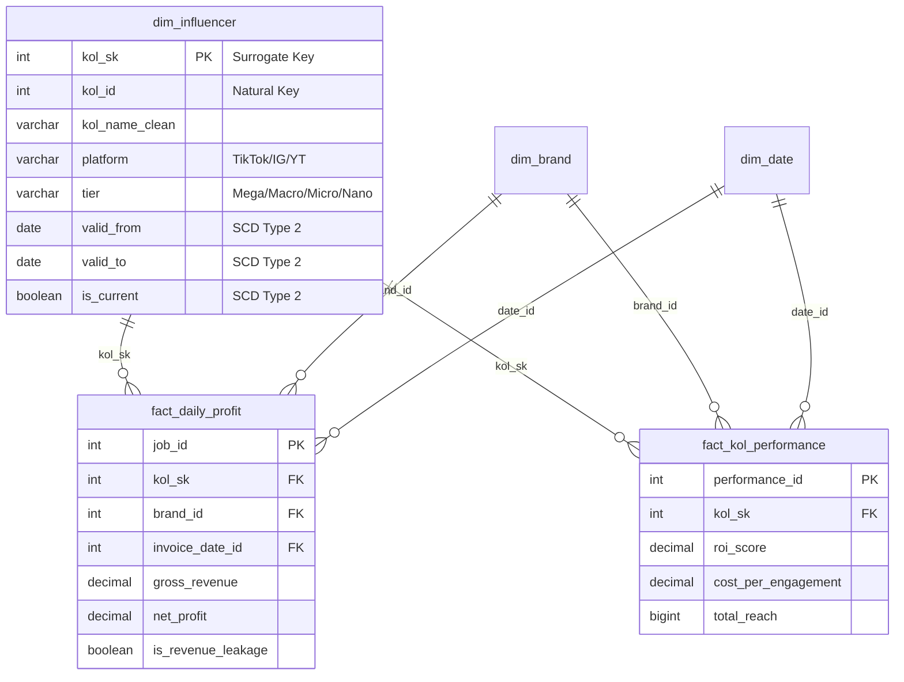
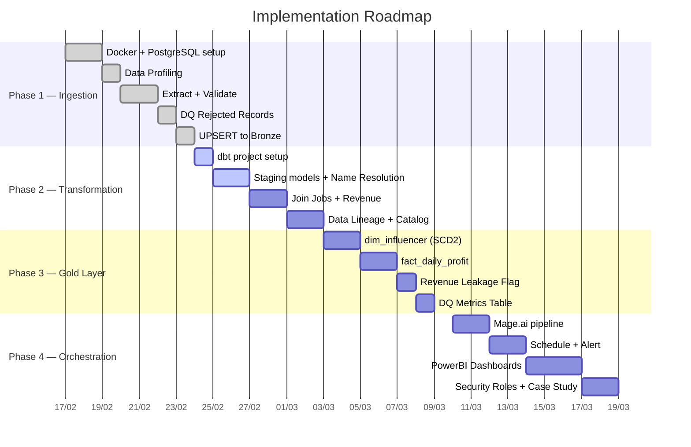

<p align="center">
  
</p>

<h1 align="center">Revenue Intelligence Platform</h1>

<p align="center">
  <strong>End-to-End Data Warehouse for Influencer Marketing Agency</strong>
</p>

<p align="center">
  
  
  
  
  
  
</p>

<p align="center">
  <a href="docs/DE_blueprint_2026.md">📋 Blueprint</a> · 
  <a href="docs/architecture_design.md">🏗️ Architecture</a> · 
  <a href="docs/business_architecture.md">🏢 Business Context</a>
</p>

---

## Giới thiệu

Dự án xây dựng **Data Warehouse tự động hóa hoàn toàn** cho một Influencer Marketing Agency (~100-150 nhân sự, 2 văn phòng HN + HCM). Pipeline chạy hàng ngày lúc 7:00 AM, tổng hợp dữ liệu từ nhiều nguồn phân tán (Excel, Inhouse System, Influencer Platform) vào một **Star Schema** duy nhất, phục vụ ra quyết định kinh doanh cho CEO, Finance, và Account Team.

### Tại sao dự án này tồn tại?

Agency đang bị **thất thoát doanh thu** và **chậm ra quyết định** vì dữ liệu nằm rải rác ở 3 nơi khác nhau, không ai biết bản nào đúng:

| Vấn đề | Ảnh hưởng | Pipeline giải quyết |
|:---|:---|:---|
| Job hoàn thành nhưng quên thu tiền | ~5% doanh thu/tháng bị thất thoát | Flag `is_revenue_leakage` tự động |
| CEO cần data KOL ROI để pitch | Mất 2-3 ngày tổng hợp thủ công | Dashboard sẵn sàng lúc 8:30 AM |
| Tên KOL không nhất quán giữa các nguồn | 30% bản ghi bị duplicate | KOL Name Resolution tự động |
| 3 nguồn Excel song song, không đồng bộ | Quyết định sai vì data sai | Single Source of Truth (Gold Layer) |

---

## Kết quả đo lường được

```
✓ Loại bỏ 20 giờ/tháng công việc thủ công
✓ Phát hiện $2,000+ tiền chưa thu ngay tháng đầu tiên
✓ Giảm thời gian pitch từ 3 ngày xuống 1 giờ  
✓ Data accuracy từ 70% lên 99.9%
✓ Zero data loss nhờ Idempotent pipeline + DQ Database
```

---

## Kiến trúc Hệ thống

### Data Engineering Lifecycle

Dự án tuân theo **Data Engineering Lifecycle** (Reis & Housley, 2022):

```
Generation → Ingestion → Storage → Transformation → Serving
                                        ↕
                              Undercurrents:
                    Security · DataOps · Data Architecture
                    Orchestration · Data Management
```

### Pipeline Architecture



### Data Model (Star Schema — Kimball)



> Chi tiết đầy đủ: [Architecture Design](docs/architecture_design.md) (Component, Sequence, Activity, ERD, Deployment diagrams + ADR + SLA)

---

## Tech Stack

| Layer | Technology | Vai trò |
|:---|:---|:---|
| **Ingestion** | Python 3.11 (Pandas, OpenPyxl) | Extract từ Excel, xử lý merged headers, encoding |
| **Validation** | Great Expectations | Data Quality gate — chặn data bẩn trước khi vào hệ thống |
| **Storage** | PostgreSQL 14 (Docker) | Medallion Architecture: Bronze → Silver → Gold |
| **Transformation** | dbt-core | Business logic (SQL + Jinja), unit test, Data Catalog |
| **Orchestration** | Mage.ai | Pipeline DAG, cron scheduling, job monitoring |
| **BI / Serving** | PowerBI | Dashboards: Revenue Leakage, KOL ROI, DQ Monitor |
| **Containerization** | Docker Compose | postgres + pgAdmin + Mage.ai |
| **Testing** | pytest + dbt test | Python unit tests + SQL data tests |
| **Alerting** | Slack Webhook | Pipeline success/failure notifications |

---

## Nền tảng Lý thuyết

Dự án được thiết kế dựa trên các framework từ 7 cuốn sách Data Engineering:

| Concept | Áp dụng | Nguồn |
|:---|:---|:---|
| **Data Engineering Lifecycle** | 5 giai đoạn: Generation → Ingestion → Storage → Transformation → Serving | *Fundamentals of DE — Reis & Housley* |
| **Undercurrents** | Security (Postgres Roles), DataOps (CI/CD), Data Management (dbt docs) | *Fundamentals of DE* |
| **Star Schema** | Fact + Dimension tables tối ưu cho BI read queries | *The Data Warehouse Toolkit — Kimball* |
| **SCD Type 2** | Lưu lịch sử thay đổi tier KOL (Micro → Macro) | *Kimball, Ch.5* |
| **DQ Database** | Tách riêng data bẩn, không xóa — audit trail đầy đủ | *Building A Data Warehouse — Rainardi* |
| **Idempotent Pipeline** | UPSERT thay INSERT, chạy lại không duplicate | *Rebuilding Reliable Pipelines — Malaska* |
| **Lambda Architecture** | Batch-first, thiết kế sẵn cho Speed Layer (Kafka) | *Big Data — Nathan Marz* |

---

## Roadmap



---

## Cấu trúc Thư mục

```
revenue-intelligence-platform/
│
├── README.md
├── docker-compose.yml
├── .env.example
│
├── ingestion/                  # Python extraction scripts
│   ├── extractors/
│   │   ├── base_extractor.py
│   │   ├── job_extractor.py
│   │   └── revenue_extractor.py
│   ├── validators/
│   │   └── great_expectations/
│   ├── loaders/
│   │   └── postgres_loader.py
│   └── profiler/
│       └── data_profiler.py
│
├── dbt_project/                # dbt transformation
│   ├── models/
│   │   ├── staging/            # Bronze → Silver
│   │   ├── intermediate/       # Business logic joins
│   │   └── marts/              # Gold Layer (Star Schema)
│   ├── tests/
│   ├── macros/
│   └── schema.yml              # Data Catalog
│
├── orchestration/              # Mage.ai pipeline definitions
│   └── pipelines/
│       └── daily_etl/
│
├── dashboards/                 # PowerBI files + screenshots
│
├── tests/                      # pytest suite
│
└── docs/                       # Documentation
    ├── banner.png
    ├── DE_blueprint_2026.md
    ├── architecture_design.md
    └── business_architecture.md
```

---

## Thiết kế cho Mở rộng

| Kịch bản | Giải pháp | Effort |
|:---|:---|:---|
| Thêm nguồn dữ liệu (CRM, API) | Thêm 1 Extractor module mới kế thừa `BaseExtractor` | Low |
| Chuyển lên Cloud (AWS/GCP) | Đổi connection string trong `.env` | Low |
| Real-time tracking | Thêm Kafka trước Ingestion Layer (Lambda Architecture) | Medium |
| Data Lakehouse | Chuyển Bronze sang Delta Lake / Apache Iceberg | Medium |

---

## Tài liệu Chi tiết

| Tài liệu | Nội dung |
|:---|:---|
| [DE Blueprint 2026](docs/DE_blueprint_2026.md) | Kế hoạch thực hiện: Phases, Tasks, Test Cases, Tech Stack, CV Keywords |
| [Architecture Design](docs/architecture_design.md) | Sơ đồ kỹ thuật: Component, Sequence, Activity, ERD, Deployment + ADR + SLA |
| [Business Architecture](docs/business_architecture.md) | Business Context: Cơ cấu công ty, phòng ban, luồng dữ liệu, pain points |

---

<p align="center">
  <sub>Built with ❤️ as a Data Engineering portfolio project</sub>
</p>
